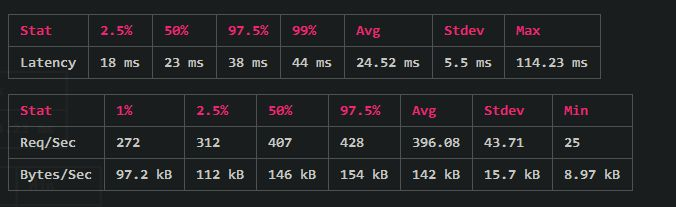
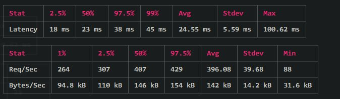
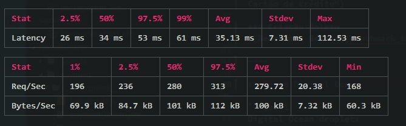
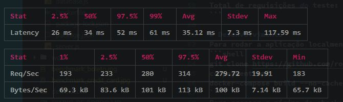

# Descrição e Diario de bordo
Este arquivo tem como objetivo demonstrar como você poderá baixar e executar este projeto em sua máquina local. Porém, caso você queira ler mais a fundo sobre certas escolhas feitas na aplicação ou uma visão mais aprofundada da mesma, basta acessar o [DIARIO_DE_BORDO](DIARIO_DE_BORDO.MD).

# Tecnologias
Node.js, Express, MongoDB, Docker e Compose.

# Dependências
Este projeto utiliza docker e docker-compose(versão 3). Para verificar se você possui instalado:

```shell
docker --version // Docker version 18.09.2, build 6247962
docker-compose --version // docker-compose version 1.23.2, build 1110ad01
```

Caso a sua máquina não possua o docker ou o compose, basta seguir a orientação da documentação oficial [Docker](https://docs.docker.com/install/) e [Compose](https://docs.docker.com/compose/install/).

# Desenvolvimento
Para rodar a aplicação localmente:
```shell
git clone https://github.com/rodrigodata/payment-api.git
cd payment-api
docker-compose build --no-cache & docker-compose up --build --force-recreate
```
Para acessar a página de checkout, acesse `localhost:8080` em seu navegador.

# Testes
O projeto possui três tipos de testes: unitário, testes de endpoint e testes de desempenho da aplicação. Caso não tenha feito a build, executar também:
```shell
docker-compose build --no-cache
```

```shell
// Rodar testes contra endpoint da aplicação
docker-compose -p payment_api_tests_api run -p 3006 --rm payment npm run tests:api

// Rodar testes unitarios da aplicação
docker-compose -p payment_api_tests_unit run -p 3007 --rm payment npm run tests:unit
```

## Teste de desempenho
Para rodar o benchmark, basta:
```shell
docker-compose build --no-cache & docker-compose up // executar em um terminal
cd payment & npm run install:only:setup & npm run tests:benchmark // executar em outro terminal
```

### Rodando localmente
   
Configuração:
```shell
- Processador: i7-7700 @ 3.60GHz
- Memória RAM: 16GB DDR4
- Storage: SSD

Conexões: 10
Requisições por conexão: 500
Total de requisições do teste: 50000

```
#### Criação Cartão de Crédito



#### Criação Boleto


----

### Rodando no Digital Ocean

```shell
Digital Ocean droplet:
- Processador: 2 nucleos
- Memória RAM: 8GB
- Storage: SSD

Conexões: 10
Requisições por conexão: 500
Total de requisições do teste: 50000
```

#### Criação Cartão de Crédito



#### Criação Boleto



# API - Considerações
Toda a aplicação está escutando na porta `8080`. Tanto a página de checkout, quanto a nossa API. Para ver melhor como está configurado, veja o arquivo [`default.conf`](default.conf). 

## Criação de pagamentos `[POST]` `localhost:8080/api/v1/payment`
Existem dois tipos de pagamento: `boleto` ou `credit_card`. Qualquer outro tipo de pagamento que seja informado a aplicação irá gerar exceção.

- BOLETO:
```shell
{
	"client": {
		"id": 1
	},
	"buyer": {
		"name": "John Doe",	
		"email": "john@doeeee.com",
		"cpf": "222.333.666-38"
	},
	"paymentInformation": {
		"amount": 10000,
		"type": "boleto"
	}
}
```


retorno:
```shell
{
    "id": "5cda07a78a0cc7000f1ce81d",
    "boletoNumber": "03399.63290 64000.000006 00125.201020 4 56140000017832"
}
```


- CREDIT_CARD:
   
```shell
{
	"client": {
		"id": 1
	},
	"buyer": {
		"name": "John Doe",	
		"email": "john@doe.com",
		"cpf": "222.333.666-38"
	},
	"paymentInformation": {
		"amount": 100,
		"type": "credit_card",
		"card": {
		   "holderName": "John Doe",
		   "number": "5555666677778884",
		   "expirationDate": "04/2027",
		   "cvv": "124"
		}
	}
}
```

retorno:
```shell
{
    "id": "5cda15704ededd000f46edac",
    "status": "SUCCESS"
}
```

## Pesquisa de pagamento `[GET]` `localhost:8080/api/v1/payment/:id`

- BOLETO
```shell
{
    "id": "5cda07a78a0cc7000f1ce81d",
    "client": {
        "id": 1
    },
    "buyer": {
        "name": "JOHN DOE",
        "email": "john@doeeee.com",
        "cpf": "222.333.666-38"
    },
    "paymentInformation": {
        "amount": "10000",
        "type": "boleto",
        "status": "SUCCESS",
        "boletoNumber": "03399.63290 64000.000006 00125.201020 4 56140000017832"
    }
}
```

- CREDIT_CARD
```shell
{
    "id": "5cda15704ededd000f46edac",
	"client": {
		"id": 1
	},
	"buyer": {
		"name": "John Doe",	
		"email": "john@doe.com",
		"cpf": "222.333.666-38"
	},
	"paymentInformation": {
		"amount": 100,
		"type": "credit_card"
        "status": "SUCCESS",
		"card": {
		   "holderName": "John Doe",
		   "number": "5555666677778884",
		   "expirationDate": "04/2027",
		   "cvv": "124"
		}
	}
}
```